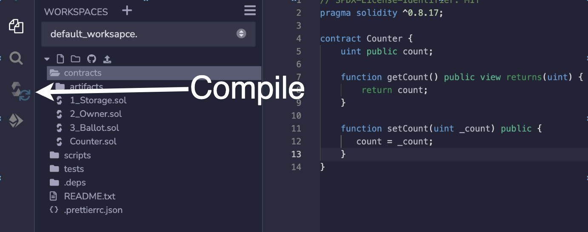
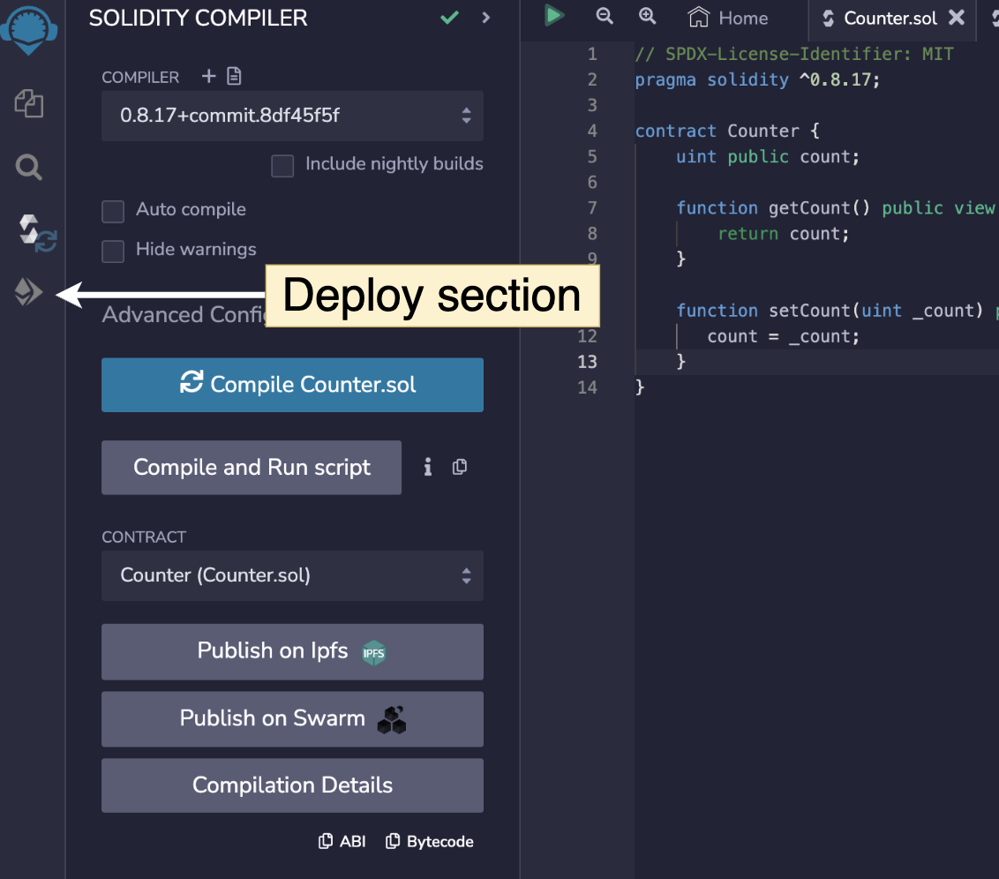
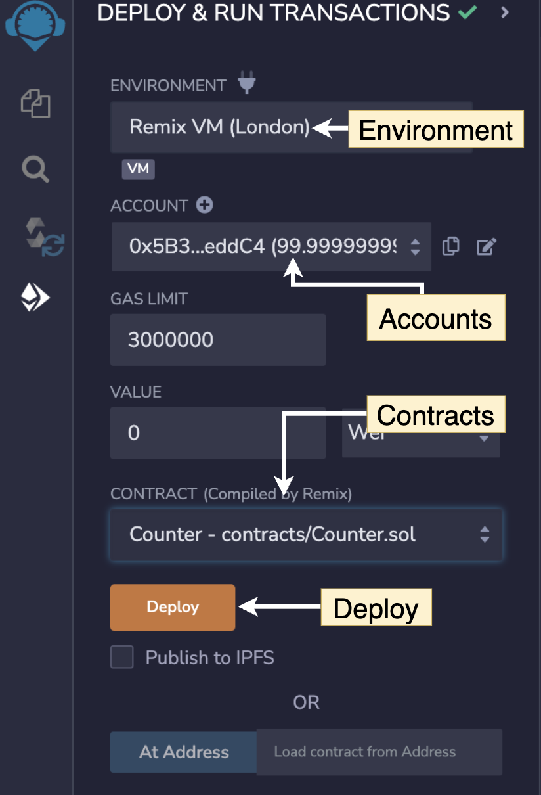
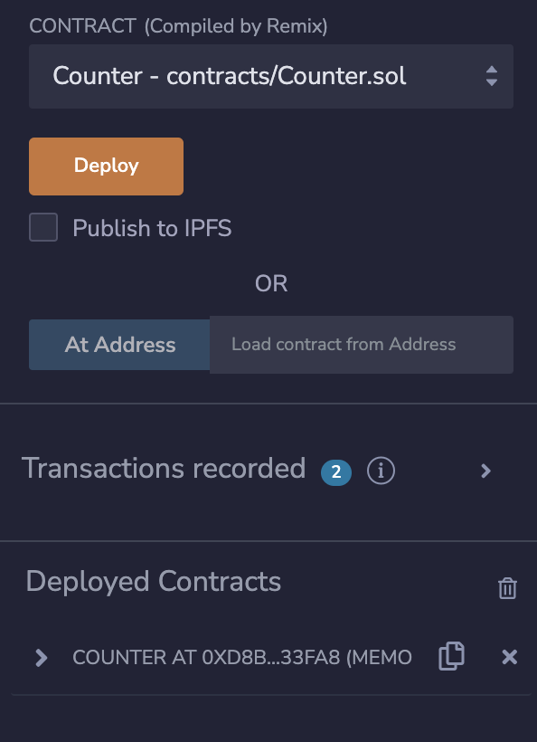
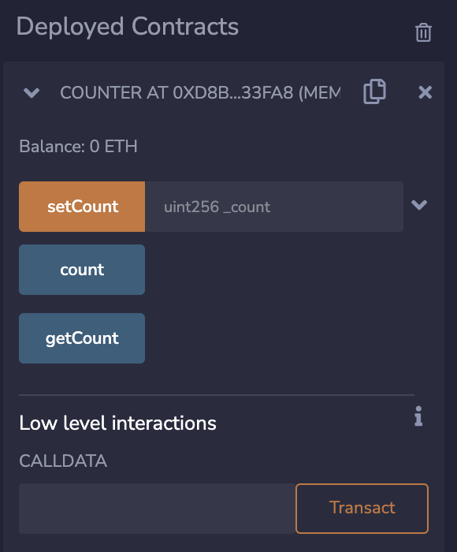

## What is solidity?

[Solidity](https://docs.soliditylang.org/) is an object-oriented, high-level language for implementing smart contracts for ethereum blockchain and other EVM compatible chains. 
This tutorial will deal with 0.8.17 version of solidity, which is as of now the latest version of solidity

## What is remix?
[Remix](https://remix.ethereum.org/) is a Solidity IDE that’s used to write, compile and debug Solidity code. In this tutorial we will be using [remix](https://remix.ethereum.org/) to develope our smart contract

### Starting with new contract
Click on the contracts folder and then click on the new file button on top right


Let our new file name be `Counter.sol`. Here `.sol` is the file extension used for solidity file and capital letter is used for file names. After creating the file our folder should look something like this


Let's begin writing our smart contract.

```solidity
// SPDX-License-Identifier: MIT
pragma solidity ^0.8.17;
```

Here first line indicates the license used by our smart contract. It's kind of optional your code will still run if you don't mention it. `//` indicates a comment, hence the license which we mentioned is just a comment. 

`pragma solidity ^0.8.17` tells which version of compiler whould be used to compile the code here compiler version mentioned is `0.8.17` and `^` symbol tells that any version which is above the specified version can be used to compile the code. 


Let's create the contract
```solidity
// SPDX-License-Identifier: MIT
pragma solidity ^0.8.17;

contract Counter {
    // your code goes here
}
```

Here contract is kind of a class where we can define various functions inside it and we can also inherit from other contracts. `Counter` is the name of the contract and as per convention it should match the file name.

Lets make a variable inside this contract
```solidity
contract Counter {
    uint public count;
}
```
+ `uint` represents unsigned integer i.e integer without any sign, hence it can only store positive intgeres.
+ `public` is the visiblity of the variable. We will discuss more about visiblity in upcoming sections. For now just imagine `public` keyword as the name suggest it's public and it doesn't have any restriction on who can view it. 
+ `count` is the name of the variable. 
> Note: `count` here is a state variable. We will discuss about variable scope in upcoming chapters

In order to fetch and set the count values lets write getter and setter function.

```solidity
function getCount() public view returns(uint) {
    return count;
}
```

+ `function` keyword used to define the function.
+ `getCount` name of the function
+ `public` visiblity/access type
+ `view` it refers to state mutablity. We will visit this topic later
+ `returns` tells about return type of the function. In our case the return type was uint.

```solidity
function setCount(uint _count) public {
    count = _count;
}
```

+ `uint _count` is the parameter to setCount function. `_count` is the name of the parameter whereas `uint` is the type
We are setting our global state variable count with the value provided by the user.

Entire code will look like this
```solidity
// SPDX-License-Identifier: MIT
pragma solidity ^0.8.17;

contract Counter {
    uint public count;

    function getCount() public view returns(uint) {
        return count;
    }

    function setCount(uint _count) public {
       count = _count;
    }
}
```

### How to run the code
There are 2 steps to run the code. 
1. Compile
2. Deploy

#### 1. Compile
In order to compile click on compile option at the left side of the screen



After clicking on the compile button, compile tab will open.


1. Select the compiler version from the drop down
2. Click auto compile (optional, if you turn on this option then you can skip this step for future deployments)
3. Select the contract to compile.(In our example we only have one contract hence you will only see one contract)
4. Click compile button

Compiler converts our human readable code to machine level code which can be read by EVM. 

#### 2. Deploy
Click on deploy screen which is at left side of the screen.



After selecting the tab you will see below screen



1. `Environment` tells where you want to deploy your contract. Basically here you can select the chain you want your contracts to deployed on. For now select Remix VM, it's a virtual blockchain which is running your client(browser), this is used while developing the code. 
2. `Accounts` this are test accounts which are available in selcted blockchain. 
3. `Contracts` here you select the contracts which you want to deploy
4. `Deploy` button used to deploy the contracts

Once you click on the deploy button you will see something like this

Click `>` button to expand the deployed contracts and you will see all the functions avaialble



Here orange denotes setter function and blue indicates getter function. You may be wondering about the count function, I will address this little later.

+ In order to call a setter function simply pass the parameter value `_count` 
+ In bottom right side of the screen you can see detail regarding the transaction. One very important thing to note here is **Only setter functions requires a blockchain transaction**. Setting a state requires a blockchain chain transaction and it costs transaction fees.
+ In order to call getter function you simply click on the function name and getter function do not require any transaction.

Now let's discuss about elephant in the room i.e is count function. As count variable was public, solidity compiler when compiling the smart contract it created a getter function for this public variable. In general every variable in smart contract that are public don't require any additional getter function solidity by defaults makes a public funtion with same variable name for you.

So we can get rid of our getCount function and our final contract will look like this. 
```solidity
// SPDX-License-Identifier: MIT
pragma solidity ^0.8.17;

contract Counter {
    uint public count;

    function setCount(uint _count) public {
       count = _count;
    }
}
```
