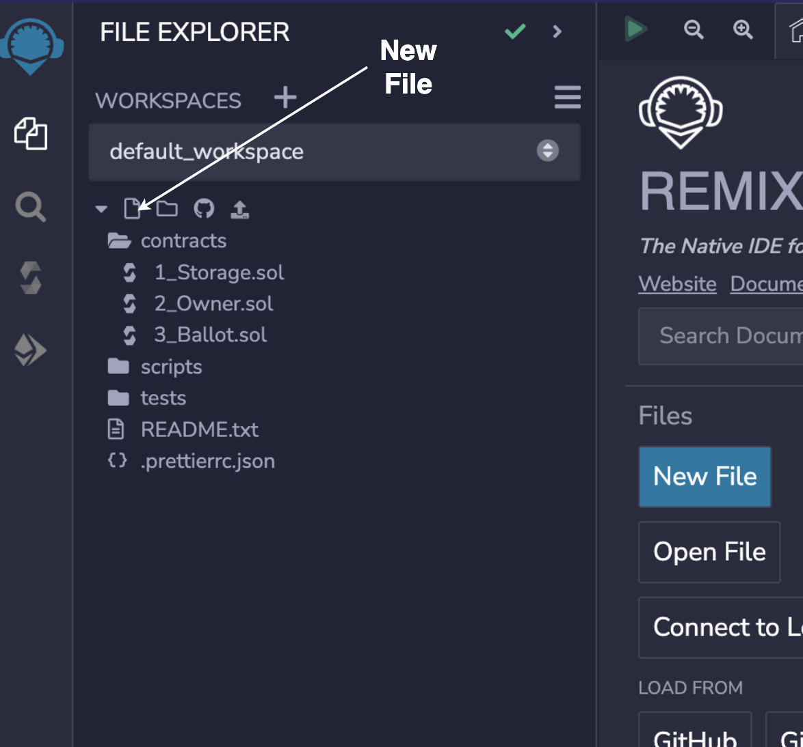
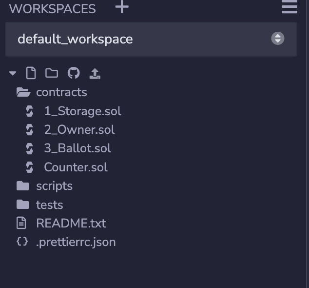

## What is solidity?

[Solidity](https://docs.soliditylang.org/) is an object-oriented, high-level language for implementing smart contracts for ethereum blockchain and other EVM compatible chains. 
This tutorial will deal with 0.8.17 version of solidity, which is as of now the latest version of solidity

## What is remix?
[Remix](https://remix.ethereum.org/) is a Solidity IDE that’s used to write, compile and debug Solidity code. In this tutorial we will be using [remix](https://remix.ethereum.org/) to develope our smart contract

### Starting with new contract
Click on the contracts folder and then click on the new file button on top right




Let our new file name be `Counter.sol`. Here `.sol` is the file extension used for solidity file and capital letter is used for file names. After creating the file our folder should look something like this




Let's begin writing our smart contract.

```solidity
// SPDX-License-Identifier: MIT
pragma solidity ^0.8.17;
```

Here first line indicates the license used by our smart contract. It's kind of optional your code will still run if you don't mention it. `//` indicates a comment, hence the license which we mentioned is just a comment. 

`pragma solidity ^0.8.17` tells which version of compiler whould be used to compile the code here compiler version mentioned is `0.8.17` and `^` symbol tells that any version which is above the specified version can be used to compile the code. 


Let's create the contract
```solidity
// SPDX-License-Identifier: MIT
pragma solidity ^0.8.17;

contract Counter {
    // your code goes here
}
```

Here contract is kind of a class where we can define various functions inside it and we can also inherit from other contracts
