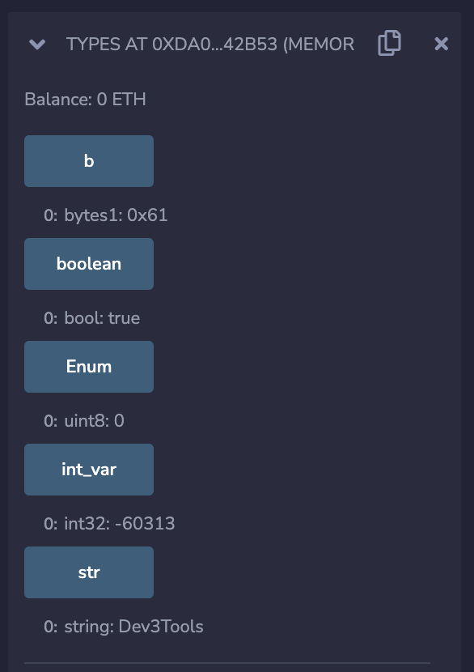

In this blog we will discuss about variables in solidity. Variables are the names you give to data locations which are used to store values in a smart contract.


## Types of variable
1. State variable
2. Local variable
3. Global variable


#### 1. State variable
Store permanent data in the smart contract (referred to as persistent state) by recording the values on the blockchain. These are not defined in any function it's outside a function. 

#### 2. Local variable
These variables are generally defined inside a function and cannot be accessed from outside that function’s scope. These are “transient” pieces of data that hold information for short periods of time while running computations. These values are not stored permanently on the blockchain.

#### 3. Global variables
These variables and functions are “injected” into your code by Solidity, and made available without the need to specifically create or import them from anywhere. These provide information about the blockchain environment the code is running on and also include utility functions for general use in the program. Global variables aren’t declared by you - they are “magically” available for you to use.

#### Varibale example
```solidity
// SPDX-License-Identifier: MIT
pragma solidity ^0.8.17;

contract Variable {
    uint public stateV;  // <----- State variable

    function setStateVariable(uint _count) public {
       stateV = _count; 
    }

    function localVariable() public pure returns(uint) {
        uint localV = 23; // <----- Local variable
        return localV;
    }

    function globalVariable() public view returns(address) {
        return msg.sender; // <----- Global variable
    }
}
```

+ In our example public `stateV` is a state variable and entire contract can read and write the value of `stateV`

+ `localV` is our local variable and it's scope is defined only inside function `localVariable`. Only code which is inside function `localVariable` will be able to access it.

+ `msg.sender` is our global variable, we haven't declared and it's decalred by solidity itself and nobody can edit this variable. We will discuss about `msg.sender` further down the course, for now assume that it's a variable which has information about the caller of function.

## Solidity Data Types
Solidity is a statically typed language, which implies that the type of each of the variables should be specified. Data types allow the compiler to check the correct usage of the variables. The declared types have some default values called Zero-State, for example for bool the default value is False. Likewise other statically typed languages Solidity has Value types and Reference types. Don't worry if you dont get the difference between Value and Reference types we will revesit this topic when we learn about storage slots (how data are stored in smart contract)

#### Value Types
Value-type variables store their own data. These are the basic data types provided by solidity. These types of variables are always passed by value. The variables are copied wherever they are used in function arguments or assignments. Value type data types in solidity are listed below: 

| Type      | Description | Default |
| ----------- | ----------- | ----------- |
| Boolean      | Stores only two values True or False       | false |
| Integer   | Stores integer values, int and uint are used to declare signed and unsigned integers respectively. To specify the different sizes, we have keywords like uint8 upto uint256, that is of 8 to 256 bits. uint8 value ranges from 0 - 255 (2^8-1), as 8bits can only store 2^8 values       |0|
| Address      |  Address hold a 20-byte value which represents the size of an  Ethereum address. Address is the user's identity in a blockchain, it's similar to username in traditional system | 0x000...000 |
| Bytes      |  Although bytes are similar to strings, there are some differences between them. bytes used to store a fixed-sized character set while the string is used to store the character set equal to or more than a byte. The length of bytes is from 1 to 32, while the string has a dynamic length.  | 0x0 |
| Enums      |  It is used to create user-defined data types, used to assign a name to an integral constant which makes the contract more readable, maintainable, and less prone to errors. Options of enums can be represented by unsigned integer values starting from 0.  | 0 (first option) |

Example of a contract using different variable types
```solidity
// SPDX-License-Identifier: MIT
pragma solidity ^0.8.17;   
   
// Creating a contract
contract Types {   
 
    // Initializing Bool variable
    bool public boolean = true;
    
    // Initializing Integer variable
    int32 public int_var = -60313;
 
    //  Initializing String variable
    string public str = "Dev3Tools";
 
    // Initializing Byte variable
    bytes1 public b = "a";
     
    // Defining an enumerator
    enum my_enum { dev, three , tools } 
 
    // Defining a function to return
    // values stored in an enumerator
    function Enum() public pure returns(
      my_enum) {   
        return my_enum.tools;   
    }   
}
```
Output:




#### Reference Types

Reference type variables store the location of the data. They don’t share the data directly. With the help of reference type, two different variables can refer to the same location where any change in one variable can affect the other one. Reference types in solidity are listed below: 
| Type      | Description |
| ----------- | ----------- |
| Arrays      | An array is a group of variables of the same data type in which the variable has a particular location known as an index. By using the index location, the desired variable can be accessed. The array size can be fixed or dynamic.
| Strings      | Strings are like arrays of characters. When we use them, we might occupy bigger or shorter storage space.
| Struct      | Solidity allows users to create and define their own type in the form of structures. The structure is a group of different types even though it’s not possible to contain a member of its own type. The structure is a reference type variable that can contain both value type and reference type
| Mapping      | Mapping is the most used reference type, that stores the data in a key-value pair where a key can be any value type. It is like a hash table or dictionary as in any other programming language, where data can be retrieved by key.

Example
```solidity
// SPDX-License-Identifier: MIT
pragma solidity ^0.8.17;   
     
// Creating a contract
contract ReferenceTypes {
 
    // Defining an array   
    uint[5] public array
      = [uint(1), 2, 3, 4, 5] ;
     
    // Defining a Structure
    struct student {
        string name;
        string subject;
        uint8 marks;
    }
 
    // Creating a structure object
    student public std1;
 
    // Defining a function to return
    // values of the elements of the structure
    function structure() public returns(
      string memory, string memory, uint){
        std1.name = "John";
        std1.subject = "Chemistry";
        std1.marks = 88;
        return (
          std1.name, std1.subject, std1.marks);
    }
     
    // Creating a mapping
    mapping (address => student) result;
    address[] student_result;
}
```


